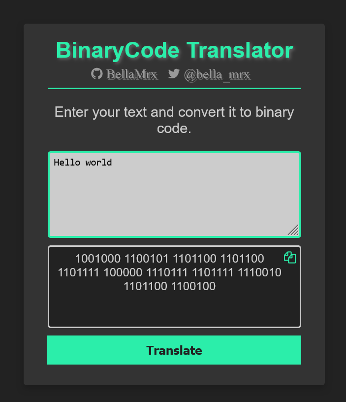
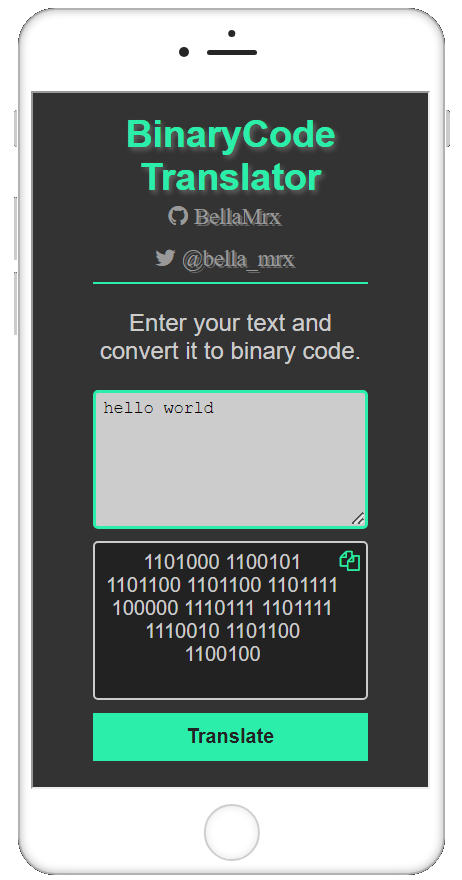

# Binary_Translator

 Translates text into a binary code.

 Try out the Binary code translator here [book-of-coding.com](https://book-of-coding.com/build_projects.html#binary-code-translator)

 `charCodeAt` - [MDN Web Docs](https://developer.mozilla.org/en-US/docs/Web/JavaScript/Reference/Global_Objects/String/charCodeAt)

 Preview

 

 Preview mobile view

 